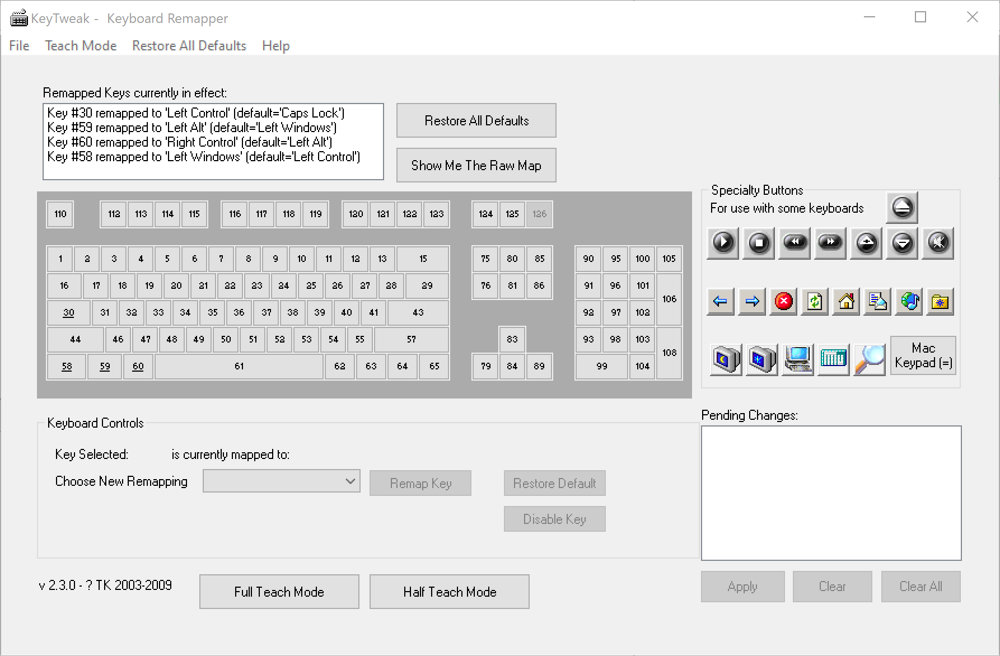
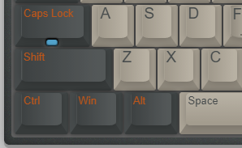
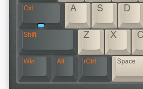

## Windows下模拟MacOS快捷键

经常 OS X和 Windows双系统交替使用，两个系统的键位区别还是挺大的。希望尽可能的统一两个系统下的键位，减少切换系统时的心智负担。

作为Copy&Paste程序员，Windows把Ctrl键放到最左边的小角落，很不方便，更不方便的是在命令行下Ctrl+C是中断，这个时候就需要使用Ctrl/Shift+Insert来复制粘贴。OS X 的设计就合理多了，复制粘贴是⌘+C/V，跟Ctrl+C完全不冲突，⌘还承担很多全局快捷键，相当于Windows下Win&Ctrl, 最重要的是⌘键就在空格左边(也就是Windows下Alt键的位置)按起来很方便。

所以我的目标就是调整 Win 下的快捷键更接近MacOS下的体验。

## 方案

原期望使用映射 Win+C/V/...  -> Ctrl+C/V/... ，实际使用过程中发现兼容性很不好。考虑到平时使用Win热键的概率不高，我把Ctrl键区分为左右两个，把右Ctrl(RCtrl)键作为⌘，然后扩展它的热键实现部分⌘/Windows的功能, 左Ctrl(LCtrl)实现简单的Emacs的keybinding，达到类似Mac下的使用体验。

为了保证最大的兼容性使用KeyTweak修改注册表的方式改键位, AutoHotKey只负责修改相应热键。

### 使用[KeyTweak](.dist/KeyTweak.exe)调整按键：

核心键位调整

LAlt -> RCtrl	

LWin -> LAlt

Ctrl 可根据所使用的键盘及使用习惯调整，我不使用Caps Lock键所以把Caps Lock键映射成LCtrl，同时把LCtrl 映射成 LWin 。

Caps Lock -> LCtrl	

LCtrl -> LWin 

keyTweak设置界面

改建示意图

### AutoHotKey 增强热键

改过键，就可以使用 "AutoHotKey" 增强热键。

#### 兼容性设计

rCtrl+C/V	原本是想直接用Ctrl/Shift+Insert代替Ctrl+C/V，在实际使用过程中发现，某些场景下(企业微信) 复制不生效，考虑到命令行窗口就那么几个，就还是保持Ctrl+C/V的默认功能，只有在命令行窗口时，映射成Ctrl/Shift+Insert。

rCtrl+W	Windows下默认是关闭标签页，像notepad,cmd 这种无标签的程序，映射成Alt+F4(关闭)，像QQ,微信这类需要常驻的程序，映射成最小化Win+Down。

这些都需要根据自己使用的App和使用习惯自行调整。

#### 快捷键

|  快捷键 | 对应快捷键 | 功能  |
|---|---|---|
| LCtrl+a | Home | 移动到行首 |
| LCtrl+e | End | 移动到行尾 |
| LCtrl+d | Del | 向后删除字符 |
| LCtrl+f | Right | 右方向键 |
| LCtrl+b | Left | 左方向键 |
| LCtrl+k | Shift+End Del | 删除到行尾 |
| RCtrl+c | 默认是Ctrl+c, 在命令行下是Ctrl+Insert | 复制 |
| RCtrl+v | 默认是Ctrl+v, 在命令行下是Shift+Insert | 粘贴 |
| RCtrl+w | 默认是Ctrl + W,如果没有有子窗口Alt+F4, 需要常驻程序Ctrl + W | 关闭当前窗口 |
| RCtrl+Tab | Alt+Tab | 切换窗口 |
| RCtrl+d | Win + d | 显示桌面 |
| RCtrl+e | Win + e | 资源管理器 |
