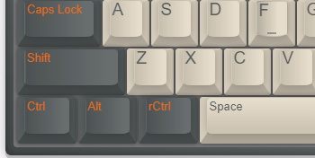

## Windows下模拟MacOS快捷键

平时主要使用 macOS 偶尔也需要在 Windows 下办公。两个系统的键位区别还是挺大的。希望尽可能的统一两个系统下的键位，减少切换系统时的心智负担。 该项目目标是调整 Windowns 下的键位，使得操作体验更接近 macOS。

> 使用Windows时，GUI程序下Ctrl+C是复制，命令行下Ctrl+C是中断程序，一个误操作可能会带来不少麻烦。

## 方案
Windows 左下角常规键位是 Ctrl/Win/Alt, 通过 KeyTweak 修改键位为 Ctrl/Alt/RCtrl。Ctrl键区分为左右两个，把右Ctrl(RCtrl)键作为⌘，实现常用⌘/Windows键的常用功能, 左Ctrl(LCtrl)实现简单的Emacs的keybinding，类似Ctrl + a/e这种。

### 使用[KeyTweak](dist/KeyTweak.exe)调整按键：

核心键位调整：
    
    1. LWin -> LAlt
    2. LAlt -> RCtrl	

keyTweak设置界面，也可以直接导入配置[macos-basic](dist/macos-basic.ktw)。

键盘示意图:

### AutoHotKey 增强热键

改过键，就可以使用 "AutoHotKey" 增强热键。
#### 快捷键

|  快捷键 | 对应快捷键 | 功能  |
|---|---|---|
| LCtrl+a | Home | 移动到行首 |
| LCtrl+e | End | 移动到行尾 |
| LCtrl+d | Del | 向后删除字符 |
| LCtrl+f | Right | 右方向键 |
| LCtrl+b | Left | 左方向键 |
| LCtrl+k | Shift+End Del | 删除到行尾 |
| RCtrl+c | 默认是Ctrl+c, 在命令行下是Ctrl+Insert | 复制 |
| RCtrl+v | 默认是Ctrl+v, 在命令行下是Shift+Insert | 粘贴 |
| RCtrl+w | 默认是Ctrl + W,如果没有有子窗口Alt+F4, 需要常驻程序Ctrl + W | 关闭当前窗口 |
| RCtrl+Tab | Alt+Tab | 切换窗口 |
| RCtrl+d | Win + d | 显示桌面 |
| RCtrl+e | Win + e | 资源管理器 |

## 兼容性设计
由于某些Windows组合键无法使用 Autohotkey 拦截所以采用 KeyTweak 与 Autohotkey 结合的方案。

原本是想直接用Ctrl/Shift+Insert代替Ctrl+C/V，在实际使用过程中发现，某些场景下(企业微信) 复制不生效，考虑到命令行窗口就那么几个，就还是保持Ctrl+C/V的默认功能，只有在命令行窗口时，映射成Ctrl/Shift+Insert。

rCtrl+W	Windows下默认是关闭标签页，像notepad,cmd 这种无标签的程序，映射成Alt+F4(关闭)，像QQ,微信这类需要常驻的程序，映射成最小化Win+Down。

这些都需要根据自己使用的App和使用习惯自行调整。